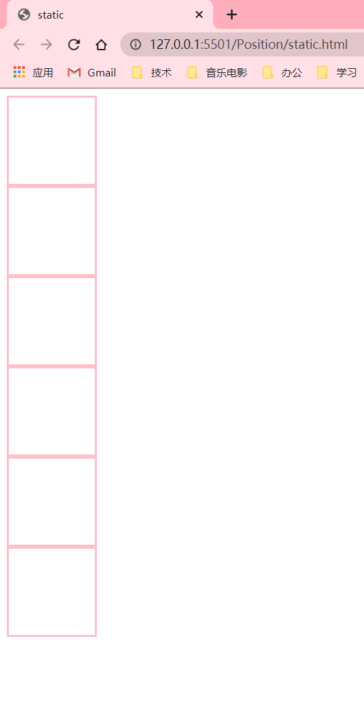
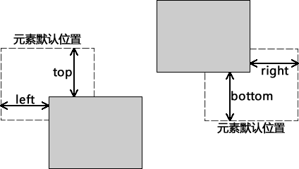
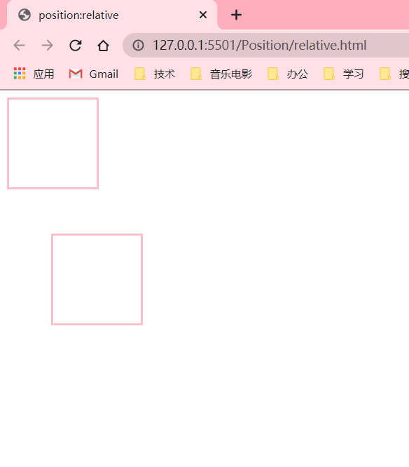
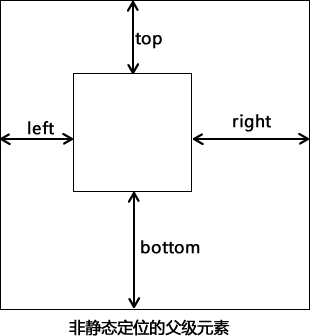
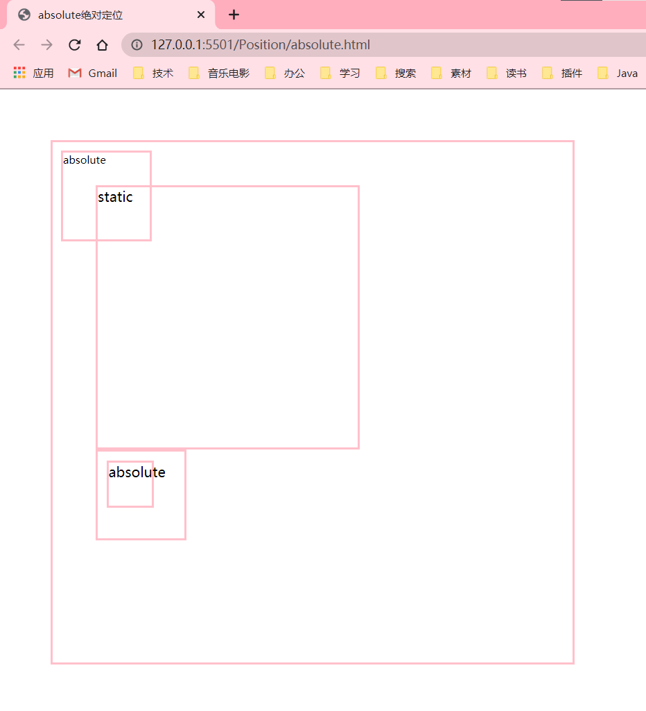
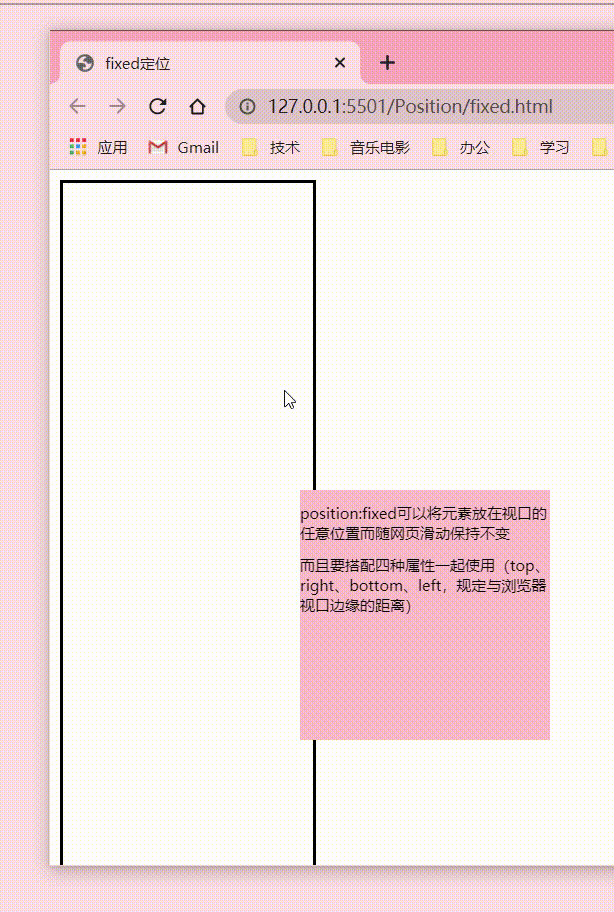
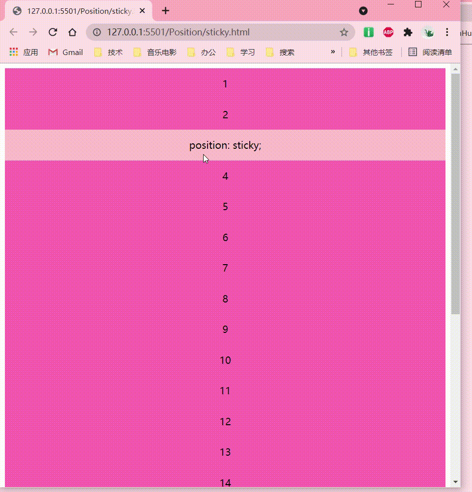

原文链接（自己有写了几个例子）：[http://c.biancheng.net/css3/position.html](http://c.biancheng.net/css3/position.html)
CSS 中的 position 属性用来设置元素在页面中的位置，通过该属性您可以把任何属性放置在任何您认为合适的位置。position 属性有 5 个可选值，分别对应 5 种不同的定位方式，如下所示：

| 取值 | 说明 |
|-----------------------|-------------|
| static | 默认值，静态定位，表示没有定位，元素会按照正常的位置显示，此时 top、bottom、left 和 right 4 个定位属性也不会被应用。 |
| relative | 相对定位，即相对于元素的正常位置进行定位，您可以通过 top、right、bottom、left 这 4 个属性来设置元素相对于正常位置的偏移量，在此过程中不会对其它元素造成影响。 |
| absolute | 绝对定位，相对于第一个非 static 定位的父级元素进行定位，可以通过 top、right、bottom、left 这 4 个属性来设置元素相对于父级元素位置的偏移量。如果没有满足条件的父级元素，则会相对于浏览器窗口来进行定位。使用绝对定位的元素不会对其它元素造成影响。 |
| fixed | 固定定位，相对于浏览器的创建进行定位，可以使用 top、right、bottom、left 这 4 个属性来定义元素相对于浏览器窗口的位置。使用固定定位的元素无论如何滚动浏览器窗口元素的位置都是固定不变的。 |
| sticky | 粘性定位，它是 relative 和 fixed 的结合体，能够实线类似吸附的效果，当滚动页面时它的效果与 relative 相同，当要滚动到屏幕之外时则会自动变成 fixed 的效果。 |

## 1\. 静态定位：static

static 是 position 属性的默认值，表示没有定位，使用静态定位的元素会按照元素正常的位置显示，并且不会受到 top、bottom、left、right 和 z-index 属性的影响。示例代码如下：
```html
<!DOCTYPE html>
<html lang="en">

<head>
    <meta charset="UTF-8">
    <meta http-equiv="X-UA-Compatible" content="IE=edge">
    <meta name="viewport" content="width=device-width, initial-scale=1.0">
    <title>float</title>
    <style>
        .son {
            position: static;
            /* static指定元素使用正常的定位行为，即遵循正常文档流*/
            width: 100px;
            height: 100px;
            border: solid pink;
        }
    </style>
</head>

<body>
    <div class="son"></div>
    <div class="son"></div>
    <div class="son"></div>
    <div class="son"></div>
    <div class="son"></div>
    <div class="son"></div>
</body>

</html>
```

运行结果如下图所示：




## 2\. 相对定位：relative

相对定位就是元素相对于自己默认的位置来进行位置上的调整，您可以通过 top、bottom、left 和 right 四个属性的组合来设置元素相对于默认位置在不同方向上的偏移量。




【示例】下面通过代码来演示相对定位的使用：
```html
<!DOCTYPE html>
<html lang="en">
<head>
    <meta charset="UTF-8">
    <meta http-equiv="X-UA-Compatible" content="IE=edge">
    <meta name="viewport" content="width=device-width, initial-scale=1.0">
    <title>position:relative</title>

    <style>
         .above {
            /* display: flex;
            flex-wrap: wrap-reverse; */
        }

        .son1 {
            position: static;/* static指定元素使用正常的定位行为，即遵循正常文档流*/
            width: 100px;
            height: 100px;
            border: solid pink;
        }
        .son2 {
            position: relative;/* relative就是元素相对于自己默认（遵循正常文档流的情况下）的位置
            进行位置上的的调整，可以通过top、bottom、left、right四个属性的组合设置元素
            相对于默认位置在不同方向上的偏移量*/
            top:50px;
            left:50px;
            width: 100px;
            height: 100px;
            border: solid pink;
        }
    </style>
</head>
<body>
    <div class="above">
        <div class="son1"></div>
        <div class="son2"></div>
    </div>
</body>
</html>
```

运行结果如下图所示：




注意：相对定位的元素可以移动并与其他元素重叠，但会保留元素默认位置处的空间。

## 3\. 绝对定位：absolute

绝对定位就是元素相对于第一个非静态定位（static）的父级元素进行定位，如果找不到符合条件的父级元素则会相对与浏览器窗口来进行定位。您同样可以使用 top、bottom、left 和 right 四个属性来设置元素相对于父元素或浏览器窗口不同方向上的偏移量。



使用绝对定位的元素会脱离原来的位置，不再占用网页上的空间。与相对定位相同，使用绝对定位的元素同样会与页面中的其它元素发声重叠，另外使用绝对定位的元素可以有外边距，并且外边距不会与其它元素的外边距发生重叠。

【示例】下面通过示例来演示绝对定位的使用：

```html
<!DOCTYPE html>
<html lang="en">

<head>
    <meta charset="UTF-8">
    <meta http-equiv="X-UA-Compatible" content="IE=edge">
    <meta name="viewport" content="width=device-width, initial-scale=1.0">
    <title>absolute绝对定位</title>
    <style>
        .container {
            position: fixed;
            border: solid;
            border-color: pink;
            width: 500px;
            height: 500px;
            margin: 50px;
            padding:50px;
        }

        .box {
            border: solid;
            border-color: pink;
            
            width: 300px;
            height: 300px;
            top: 50px;
            left: 50px;
        }

        .box2{
            position: absolute;
            border: solid;
            border-color: pink;
            width: 100px;
            height: 100px;
            font-size: 2px;
            top:10px;
            left:10px;
        }

        .relative{
            position: relative;
            border: solid;
            border-color: pink;
            width: 100px;
            height: 100px;
        }

        .absolute{
            position:absolute;
            border: solid;
            border-color: pink;
            width: 50px;
            height: 50px;
            top:10px;
            left:10px;
        }
    </style>
</head>

<body>
    <div class="container">
        <div class="box">
            static
            <div class="box2">
                absolute
            </div>

        </div>
        <div class="relative">
            <div class="absolute">
                absolute
            </div>
        </div>
    </div>
</body>

</html>
```

运行结果如下图所示：




## 4\. 固定定位：fixed

固定定位就是将元素相对于浏览器窗口进行定位，使用固定定位的元素不会因为浏览器窗口的滚动而移动，就像是固定在了页面上一样，我们经常在网页上看到的返回顶部按钮就是使用固定定位实现的。

【示例】下面通过示例来演示固定定位的使用：

```html
<!DOCTYPE html>
<html lang="en">
<head>
    <meta charset="UTF-8">
    <meta http-equiv="X-UA-Compatible" content="IE=edge">
    <meta name="viewport" content="width=device-width, initial-scale=1.0">
    <title>fixed定位</title>
    <style>
        #blank{
          width:200px;
          height:1000px;
          border:solid;
        }

        #position{
            position:fixed;
            width:200px;
            height:200px;
            background-color:pink;
            font-size: 10px;
            bottom:100px;
            left:200px;
        }
    </style>
</head>
<body>
    <div id="blank"></div>
    <div id="position">
        <p>position:fixed可以将元素放在视口的任意位置而随网页滑动保持不变</p>
        <p>而且要搭配四种属性一起使用（top、right、bottom、left，规定与浏览器视口边缘的距离）</p>
        
    </div>
</body>
</html>
```
运行结果如下图所示：




## 5\. 粘性定位：sticky

粘性定位与前面介绍的四种定位方式不太一下，它像是相对定位和固定定位的结合体，当滚动页面时它的效果与相对定位相同，当元素滚动到一定程度时它又会呈现出固定定位的效果。比如一些网页上的导航菜单，当页面加载完成时它在自己默认的位置，当我们向下滚动页面时它又会固定在页面的最顶端。

【示例】下面通过示例来演示粘性定位的使用：

```html
<!DOCTYPE html>
<html>
<head>
    <style>
        div{
            height: 500px;
            position: relative;
        }
        p {
            width: 100%;
            height: 50px;
            margin: 0;
            text-align: center;
            line-height: 50px;
            background-color: hotpink;
        }
        .sticky {
            background-color: pink;
            position: sticky;
            top:0px;
        }
    </style>
</head>
<body>
    <div>
        <p>1</p>
        <p>2</p>
        <p class="sticky">position: sticky;</p>
        <p>4</p>
        <p>5</p>
        <p>6</p>
        <p>7</p>
        <p>8</p>
        <p>9</p>
        <p>10</p>
        <p>11</p>
        <p>12</p>
        <p>13</p>
        <p>14</p>
        <p>15</p>
        <p>16</p>
        <p>17</p>
        <p>18</p>
        <p>19</p>
        <p>20</p>
        <p>21</p>
        <p>22</p>
        <p>23</p>
    </div>
</body>
</html>
```
运行结果如下图所示：




在使用粘性定位时，需要注意以下几点：

*   在设置`position:sticky;`时，必须再定义 top、bottom、right、left 四个属性之一，否则只会处于相对定位；
*   使用固定定位元素的父元素不能定义`overflow:hidden`或者`overflow:auto`属性；
*   父元素的高度不能低于固定定位元素的高度；
*   固定定位的元素仅在其父元素内有效。
