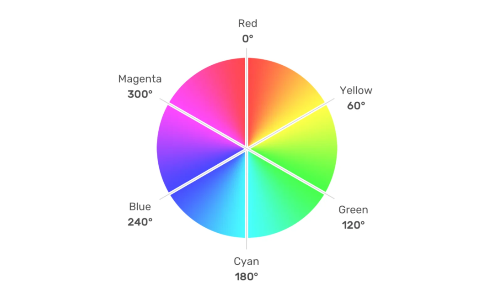
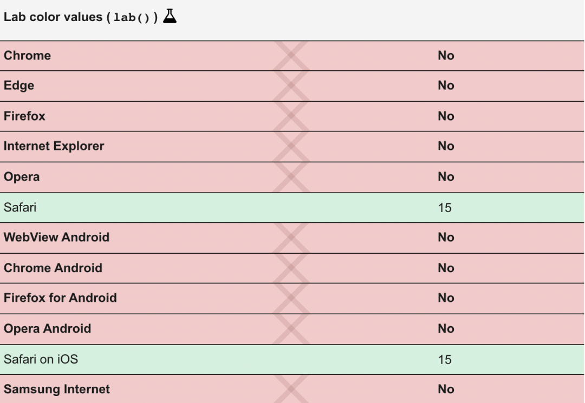
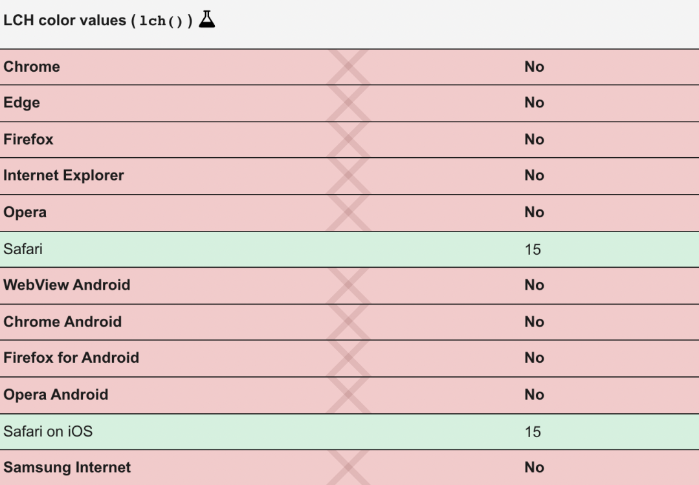

# 现代 CSS 颜色指南

[mp.weixin.qq.com](http://mp.weixin.qq.com/s?__biz=Mzg2MDU4MzU3Nw==&mid=2247493711&idx=1&sn=690d6c6a4813a7ac2ed3658a620d38db&chksm=ce268bb9f95102affb6a07998f901cf81a8740a2eaa8141b6b259285e528f7b79c58d7dc5804&mpshare=1&scene=1&srcid=1011AoKAJrRA1OCgRLWWfrf2&sharer_sharetime=1665502353704&sharer_shareid=b8d5da03cbe546fb54510ac993e581cf#rd)CUGGZ iCSS 前端趣闻

本文约**2800**字，预计阅读需要**10**分钟。

大家好，我是 Coco。

在 CSS 中颜色无处不在，它们可以作为文字、背景、阴影、表格、边框、链接等属性。我们在 CSS 中使用的大多数颜色都是 hex 和 RGB，其实表示颜色的方式有很多，下面就来认识一下 CSS 中的颜色体系！

## 1\. CSS 命名颜色

CSS 中提供了 148 个命名颜色，所有浏览器都支持这些名称，这些名称都是被预定义过色值的。下面是部分颜色名称以及对应的十六进制颜色值：


查看所有预定义颜色名称：https://www.w3schools.com/colors/colors\_names.asp

下面是使用颜色名称的示例：

```css
div {
  color: black;
  border: 1pxsolidblueviolet;
  background: skyblue;
}
```

注意：所有命名颜色都不区分大小写。

除了颜色名称，还有一些其他命名的颜色和关键字值得一提：

#### （1）transparent

transparent 关键字用作 rgba(0, 0, 0, 0)的快捷方式，它表示完全透明。该关键字目前在所有浏览器都是支持的。它是 background-color 属性的默认值。

```css
div {
  background-color: transparent;
}
```

#### （2）currentColor

currentColor 表示当前的颜色。如果没有指定，就会从父容器继承的文本颜色。所以，以下 CSS 规则是等效的：

```css
div {
  color: red;
  background-color: currentColor;
}

div {
  color: red;
  background-color: red;
}
```

该属性在 SVG 中使用时很方便，可以将指定的填充或描边颜色设置为 currentColor，以确保 SVG 颜色与其父级的文本颜色匹配。

#### （3）inherit

inherit 是一个保留字，它不局限于颜色，表示该属性采用与元素父级的属性相同的值。对于继承的属性，主要用途就是覆盖另一个规则。

#### （4）系统颜色

还有一些其他特殊的颜色关键字，它们用来匹配一些系统元素，旨在保持浏览器上应用程序的一致性。系统颜色成对出现：背景颜色-前景颜色。下面是系统颜色相关关键字：

| **背景颜色** | **前景颜色**                                  |
| ------------ | --------------------------------------------- |
| buttonFace   | buttonText                                    |
| canvas       | activeText、canvasText、linkText、visitedText |
| field        | fieldText                                     |
| highlight    | highlightText                                 |

下面是不同浏览器对系统颜色支持：


## 2\. RGB 颜色

RGB 值也是我们常用的颜色表示方式。RGB 指的就是红-绿-蓝，这个顺序非常重要。每种颜色使用 0 到 255 之间的数字指定。最常见的 RGB 值黑色：rgb(0,0,0) 和白色：rgb(255,255,255)。RGB 表示法使我们以更易读的形式来访问与十六进制值相同的颜色范围。

下面是使用 RGB 值表示颜色的示例：

```css
div {
  color: rgb(0, 0, 0);
  border: 1px solid rgb (155, 55, 89);
  background: rgb(255, 255, 255);
}
```

除此之外，我们还可以使用名为 rgba() 的属性为 rgb 值定义 alpha 值，alpha 值是透明度的百分比。它类似于 rgb，但允许添加第四个值。不透明度范围可以是 0 到 1 之间的任何值，0 是最小值（无不透明度），1 是最大值（完全不透明度）：

```css
div {
  color: rgba(0, 0, 0, 0.5);
  border: 1pxsolidrgba (255, 0, 0, 0.8);
  background: rgba(0, 125, 0, 0.2);
}
```

注意，十六进制颜色值不区分大小写。所以，#ff0000、#FF0000、#Ff0000 的显示效果是一致的。

## 3\. Hex 颜色

我们还可以使用十六进制值来表示 CSS 中的颜色，这也是我们用的最多的颜色表示方式。十六进制使用 16 个符号表示，使用 0 - 9 表示值 0 到 9，A - F 表示值 10 到 15，如下：


在 CSS 中，使用 6 个十六进制数字来表示颜色。这意味着分别使用两个数字来表示红色 (R)、绿色 (G) 和蓝色 (B) 分量。例如，#000000 表示黑色，它是最小的十六进制值；#FFFFFF 表示白色，它是最大的十六进制值。


下面是使用颜色名称的示例：

```css
div {
  color: #000000;
  border: 1pxsolid#00FF00;
  background: #ff0000;
}
```

我们也可以使用 3 个值（每种颜色一个）来缩短十六进制值，如果每两位的值相同，就可以缩写一半：

```css
div {
  color: #000;
  border: 1pxsolid#0F0;
  background: #f00;
}
```

我们也可以给十六进制颜色定义 alpha 值，alpha 值是透明度的百分比。在十六进制代码中，将另外两位数字添加到六位数字序列中，形成一个八位数字序列。例如，要在十六进制代码中设置黑色#000000，要添加 50% 的透明度，可以将其更改为#00000080。

可以看到，十六进制颜色值是很难阅读的。我们基本不太可能通过读取十六进制值来猜测元素的颜色。

## 4\. HSL 颜色

HSL 全称是 Hue-Saturation-Lightness，分别表示色调、饱和度和亮度。它基于 RGB 色轮的。每种颜色都有一个角度以及饱和度和亮度值的百分比值。下面就先来了解一下这三个概念，

- **色调：** 色调描述了色轮上的值，从 0 到 360 度，从红色开始（0 和 360）；



- **饱和度：** 饱和度是所选色调的鲜艳程度，100% 表示完全饱和的亮色，0% 表示完全不饱和的灰色；


- **亮度：** 颜色的亮度级别，较低的值会更暗，更接近黑色，较高的值会更亮，更接近白色。


HSL 颜色函数的表示形式如下：

```css
hsl(Hue,Saturation,Lightness)
```

其中 Hue 是色调值，即在色轮上的位置，可以是 0 到 360deg 之间的任何值，该参数还可以接 角度单位 turn（圈）和无单位。下面三种规则的显式效果是一样的：

```css
div {
  background-color: hsl(180deg, 50%, 50%);
}

div {
  background-color: hsl(0.5turn, 50%, 50%);
}

div {
  background-color: hsl(180, 50%, 50%);
}
```

一些常见的 HSL 颜色值：


除此之外，HSL 颜色值也可以添加 alpha 值，表示透明度，其使用形式如下：

```css
hsla(Hue,Saturation,Lightness/alpha)
```

这里就不再需要用逗号分隔值，而使用斜杠，比如：

```css
div {
  background-color: hsl(0100%50%/0.5);
}
```

## 5\. HWB 颜色

HWB 全称为 Hue-Whiteness-Blackness，表示色调、白度和黑度。

- 色调：色轮中的一个角度；
- 白度：表示要混合的白色量的百分比。值越高，颜色越白。
- 黑度：表示要混合的黑色量的百分比。值越高，颜色越黑。

与 HSL 一样，色调可以是 0 到 360 内的任何值。黑度和白度用来控制有多少黑色和白色混合在已选色调中，它们也是 0-100%之间的值，当为 100%时，就会出现全黑或者全白。如果等量的白色或者黑色混合在一起，颜色就会变得越来越灰。这个函数对于创建单色调色板非常有用：


hwb()也可以添加 alpha 值来表示透明度，也使用斜杠来分隔：

```css
hwb(1940%0%)
hwb(1940%0%/.5)
```

注意：这种颜色格式目前只在 Safari 15 上得到了支持，谨慎使用。


## 6\. LAB 颜色

LAB 是一个可以在 Photoshop 等软件中访问的颜色空间，它代表了人类可以看到的整个颜色范围。它使用三个轴表示：亮度、a 轴和 b 轴。

- **亮度：** 从黑色到白色。值越低，颜色越接近黑色。
- **a 轴：** 从绿色到红色。较低的值接近绿色，较高的值更接近红色。
- **b 轴：** 从蓝色到黄色。较低的值接近蓝色，越高的值更接近黄色。

亮度的值可以是任意百分比，不限于 0%和 100%，可以超过 100%。超亮白色可以使用高达 400% 的百分比。a 和 b 轴的值可以是正值或者负值。两个负值将导致颜色朝向光谱的绿色/蓝色端，而两个正值可以产生更橙色/红色的色调。所有参数由空格分隔：

```css
div {
  background-color: lab(80%10050);
}

div {
  background-color: lab(80%-80-100);
}
```


lab()也可以添加 alpha 值来表示透明度，也使用斜杠来分隔：

```css
div {
  backgroundcolor: lab(80%80100/0.5);
}
```

注意：这种颜色格式目前只在 Safari 15 上得到了支持，谨慎使用。



## 7\. LCH 颜色

LCH 代表亮度、色度和色调。它与 Lab 具有相同的 L 值，但不是使用坐标 a\* 和 b\*，而是使用 C（色度）和 H（色调）。色调可以是 0 到 360 之间的值。色度代表颜色的量，它类似于 HSL 中的饱和度。但是色度值可以超过 100，理论上它是无上限的。

```css
div {
  background-color: lch(80%10050);
}
```

对于色度值，目前的浏览器和显示器可以显示颜色量是有限的，只有 0-230 之间的值是有用的，超过之后就和 230 的差异就不大了：


这个方法也可以添加第四个可选参数 alpha。该函数遵循空格分隔（alpha 带有斜杠）：

```css
div {
  background-color: lch(80%10050/0.5);
}
```

注意：这种颜色格式目前只在 Safari 15 上得到了支持，谨慎使用。



那为什么有了 HSL 还需要 LAB 和 LCH 呢？因为使用 LAB 或 LCH 可以获得更大范围的颜色。LCH 和 LAB 旨在让我们能够接触到人类视觉的整个范围。除此之外，HSL 和 RGB 在感知上并不均匀，并且在 HSL 中，增加或减少亮度会根据色调产生完全不同的效果。

## 8\. CMYK 颜色

CMYK 代表 Cyan、Magenta、Yellow 和 Key，它们与打印机中的墨水颜色相匹配。虽然屏幕通常以 RGB 来显示颜色，而打印机通常使用青色、品红色、黄色和黑色的组合来表示颜色，这些是最常见的墨水颜色。

可以使用 device-cmyk()来指定 CMYK 颜色，使用空格来分隔参数，也可以添加 alpha 值来设置透明度。

```css
div {
  background-color: device-cmyk(1000);
}
```

注意，该方法存在兼容性问题，谨慎使用。

## 9\. 颜色混合

在 CSS Color Module Level 5 提案中提出了颜色混合的概念和相关方法 color-mix()，该方法可以混合了两种颜色，类似于 Sass 中的 mix()函数。color-mix() 允许我们指定颜色空间，默认使用 LCH，具有出色的混合效果。可以指定每种颜色混合多少：

```css
div {
  background-color: color-mix(inlch, red, blue);
}

div {
  background-color: color-mix(inlch, red30%, 70%blue);
}
```

###


如果觉得还不错，欢迎点赞、收藏、转发 ❤❤
